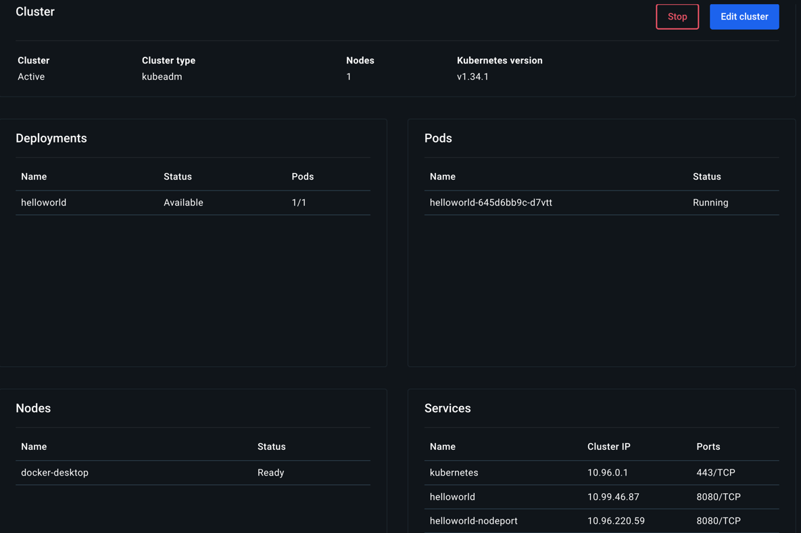
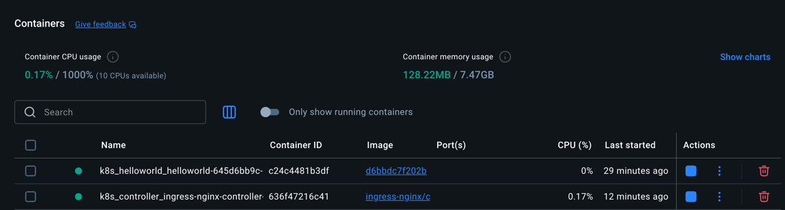
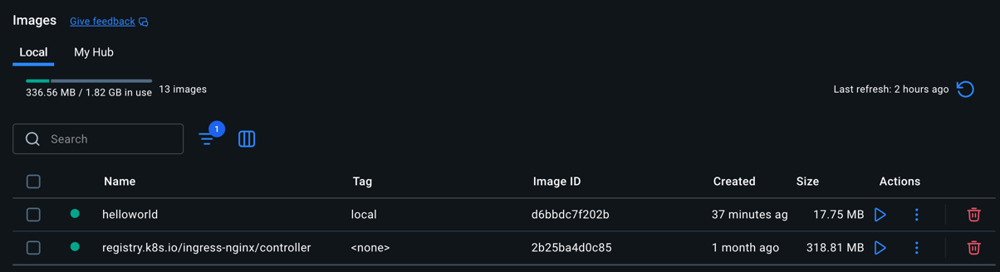
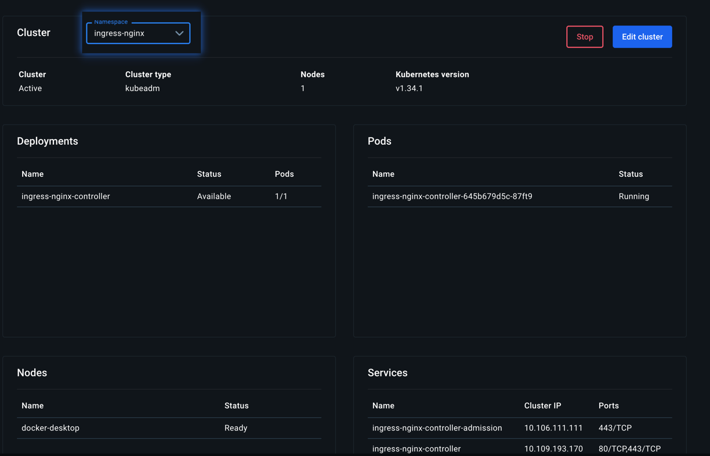

# Helloworld (Gin) — 本地与 Kubernetes 部署指南

本项目是使用 Gin 的最简 Web 服务，`GET /` 返回 `hello world`。支持本地运行、容器化以及在本地 Kubernetes（Docker Desktop / kind / minikube）部署与访问。

## 本地运行

- 安装依赖并启动：
  - `go mod tidy`
  - `go run .`
- 验证：`curl http://localhost:8080/`

## 构建与运行容器

- 构建镜像：`docker build -t helloworld:local .`
- 运行验证：`docker run --rm -p 8080:8080 helloworld:local`

## 在本地 Kubernetes 部署

1) 将镜像放入集群
- Docker Desktop Kubernetes：无需额外操作，直接使用本地镜像。

2) 应用清单并等待就绪
- `kubectl apply -f k8s/deployment.yaml -f k8s/service.yaml`
- `kubectl rollout status deployment/helloworld`

## 访问方式与原理（为何可免端口转发）

默认的 `Service` 类型是 `ClusterIP`，仅在集群内部可达。如果使用 `kubectl port-forward`，其实是在本机与 Pod 之间建立一个临时隧道；想要“直接访问”则需要让服务对主机网络可达，常见做法是 NodePort 或 Ingress：

- NodePort（L4 暴露）：在每个节点开放一个固定端口（默认范围 30000–32767），将流量转发到后端 `Service`。
  - 应用：`kubectl apply -f k8s/service.nodeport.yaml`
  - 访问：
    - Docker Desktop：`http://localhost:30080`
  - 原理：Node 的主机网络开放了一个端口，直接把外部请求转到集群内服务，无需 `port-forward`。
  - 

- Ingress（L7 路由）：需要安装 Ingress Controller（如 nginx-ingress）。Ingress 在 80/443 端口接受 HTTP(S) 请求，并按域名/路径转发到后端 `Service`。
  - 清单：`k8s/ingress.yaml`（默认 host 为 `helloworld.localdev.me`）
  - 安装 Controller：
    - Docker Desktop：使用 Helm 安装 `ingress-nginx`，其 Service 通常为 LoadBalancer，可直接通过 `localhost` 访问。
    - 单独建一个 namespace `kubectl create namespace ingress-nginx`
    - 添加官方 Helm 仓库并更新 `helm repo add ingress-nginx https://kubernetes.github.io/ingress-nginx
                             helm repo update`
    - 基本安装命令（最通用） `helm install ingress-nginx ingress-nginx/ingress-nginx --namespace ingress-nginx`
    - 执行完之后，查看 Pod 和 Service：`kubectl get pods -n ingress-nginx` `kubectl get svc -n ingress-nginx`
    - 应用 k8s/ingress.yaml `kubectl apply -f k8s/ingress.yaml`
  - 访问：`curl -H "Host: helloworld.localdev.me" http://localhost/`
  - 原理：Ingress Controller 作为反向代理(独立服务)在节点对外监听 80/443，按规则转发 HTTP 流量，无需 `port-forward`。
  - 

提示：两者的选择
- 仅需暴露单个端口时，NodePort 更简单。
- 需要基于域名/路径的 HTTP 路由、TLS 证书等能力时，使用 Ingress。

## 使用 APISIX 统一入口，并转发给 NGINX Ingress（可选）

可以的。APISIX 作为前置网关（North-South Gateway）统一做鉴权、限流、灰度等，再把流量转发给 NGINX Ingress 执行二次路由。常见于渐进式迁移或需要更强网关能力的场景。

架构要点
- APISIX 位于最前面，对外暴露 80/443；NGINX Ingress 仍按照现有 Ingress 规则把流量路由到后端服务。
- 必须保留 Host 头（默认即保留），否则 NGINX Ingress 会因主机名不匹配返回 404。
- 注意双层代理带来的影响：
  - 客户端 IP：确保两层都正确传递并信任 `X-Forwarded-For/X-Forwarded-Proto`。
  - 超时/重试：避免两层都重试导致放大；将策略收敛在 APISIX 或 NGINX 其中一层。
  - TLS：推荐在 APISIX 终止 TLS，向 NGINX 用 HTTP 转发（开发环境更简洁）。

安装与应用（示例）
1) 安装 APISIX 与 APISIX Ingress Controller（二选一方式；参考官方文档）
   - Helm（官方仓库）示例：
     - 创建namespace `kubectl create namespace apisix`
     - 添加 APISIX 官方 Helm 仓库 `helm repo add apache https://apache.github.io/apisix-helm-chart` `helm repo update`
     - 安装apisix网关 `helm install apisix apache/apisix -n apisix --create-namespace --set gateway.type=LoadBalancer`
     - 安装Ingress Controller 并安装CRDS：`helm install apisix-ingress apache/apisix-ingress-controller -n apisix --set installCRDs=true` 
     - 查看结果 `kubectl get pods -n apisix` `kubectl get svc -n apisix`
2) 应用路由，将域名流量转发给 NGINX Ingress Controller：
   - `kubectl apply -f k8s/apisix/route-to-nginx.yaml`
   - 该清单把 `helloworld.localdev.me` 的请求转发到 `ingress-nginx` 命名空间下的 `ingress-nginx-controller:80`。

3) 解析入口域名到 APISIX Gateway 地址：
   - 获取地址：`kubectl -n apisix get svc apisix-gateway`
   - Docker Desktop：通常直接通过 `http://localhost/` 访问；

4) 验证链路：
   - 确保已有 NGINX Ingress 规则指向你的后端服务（如本项目 `Service/helloworld:8080`）。
   - 访问：`curl -H "Host: helloworld.localdev.me" http://<APISIX入口地址>/` 应返回 `hello world`。
